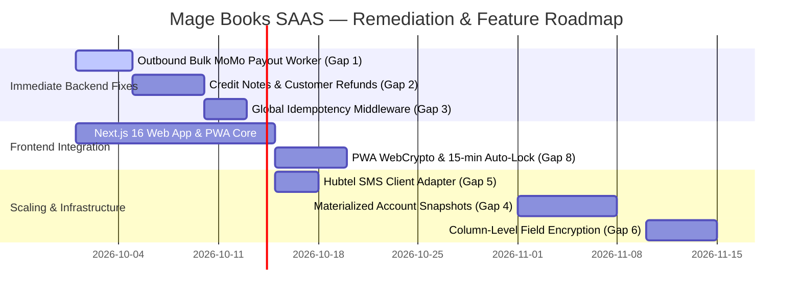

# Mage Books SAAS — Backend Implementation Gaps & Architectural Deferrals

> **Comprehensive Analysis of Gaps, Partial Implementations, and Scaling Patterns Identified via Cross-Referencing the Backend Codebase Against the Master Architecture Manual and Sequence Diagrams.**
> 
> **Component:** Backend API (`backend/`)  
> **Reference Specifications:**
> 1. [`docs/Mage Books SAAS — Comprehensive Engineering Specification & Architecture Manual.docx.md`](file:///m:/CODES/Work/magebooks-SAAS/docs/Mage%20Books%20SAAS%20%E2%80%94%20Comprehensive%20Engineering%20Specification%20&%20Architecture%20Manual.docx.md)
> 2. [`docs/Mage Books SAAS — Master Transaction Sequence Diagrams & Lifecycle Specification.docx.md`](file:///m:/CODES/Work/magebooks-SAAS/docs/Mage%20Books%20SAAS%20%E2%80%94%20Master%20Transaction%20Sequence%20Diagrams%20&%20Lifecycle%20Specification.docx.md)
> 3. [`docs/BACKEND_WORK_COMPLETED.md`](file:///m:/CODES/Work/magebooks-SAAS/docs/BACKEND_WORK_COMPLETED.md)
> 
> **Current Verification Status:** 359 / 359 Tests Passing (100%) | 0 Ruff Linter Warnings | 0 Bandit Security Vulnerabilities

---

# Table of Contents
1. [Executive Summary & Purpose](#1-executive-summary--purpose)
2. [Classification Matrix & Roadmap Prioritization](#2-classification-matrix--roadmap-prioritization)
3. [Deep-Dive Gap Specifications](#3-deep-dive-gap-specifications)
   - [Gap 1: Outbound Bulk Mobile Money Disbursal Celery Worker (`execute_bulk_momo_payroll`)](#gap-1-outbound-bulk-mobile-money-disbursal-celery-worker-execute_bulk_momo_payroll)
   - [Gap 2: Credit Notes & Customer Refunds Dedicated Models and Endpoints](#gap-2-credit-notes--customer-refunds-dedicated-models-and-endpoints)
   - [Gap 3: Generalized HTTP Idempotency-Key Middleware & Persistence Table (`idempotency_keys`)](#gap-3-generalized-http-idempotency-key-middleware--persistence-table-idempotency_keys)
   - [Gap 4: Materialized Account Snapshots (`account_snapshots`) for High-Volume Scaling](#gap-4-materialized-account-snapshots-account_snapshots-for-high-volume-scaling)
   - [Gap 5: Real-Time WebSockets & Live SMS Communications](#gap-5-real-time-websockets--live-sms-communications)
   - [Gap 6: Column-Level `pgcrypto` Encryption for Master Data Fields](#gap-6-column-level-pgcrypto-encryption-for-master-data-fields)
   - [Gap 7: Physical Banking POS Hardware Terminal Integration](#gap-7-physical-banking-pos-hardware-terminal-integration)
   - [Gap 8: Client-Side / Frontend Specific Requirements (PWA & WebCrypto)](#gap-8-client-side--frontend-specific-requirements-pwa--webcrypto)
4. [Resolved Documentation Discrepancies](#4-resolved-documentation-discrepancies)
5. [Implementation Action Plan & Phased Roadmap](#5-implementation-action-plan--phased-roadmap)

---

# 1. Executive Summary & Purpose

This document provides a transparent, exhaustive inventory of all architectural differences, partial implementations, future scaling patterns, and deferred features identified when cross-referencing the implemented backend codebase against the **Engineering Specification & Architecture Manual** and the **Master Transaction Sequence Diagrams**.

All five planned engineering sprints (Tenancy, Ledger, Invoicing, Payments, GRA Tax Clearance, Audit Immutability, Payroll, and Rogue Manager Governance) have been delivered, verified, and merged into `develop` with **359/359 automated tests passing**. 

However, comparison with the master design documents highlights 8 specific items that are either:
- **Partially Implemented**: Business rules and permissions exist, but automated background workers or dedicated REST resources are deferred.
- **Architectural Deferrals for Scale**: Documented in the Architecture Manual as reserved for the "Scaling Phase" (e.g. `account_snapshots` after 50,000+ entries) while the MVP uses Pure Dynamic SQL.
- **Third-Party Rail Dependencies**: External communication infrastructure (e.g. live GSM SMS gateways, WebSocket servers, physical POS terminals) that rely on external vendor accounts or frontend integration.

---

# 2. Classification Matrix & Roadmap Prioritization

| # | Gap / Requirement Description | Source Document & Section | Implementation State | Recommended Phase | Priority |
| :-: | :--- | :--- | :--- | :-: | :-: |
| **1** | **Outbound Bulk MoMo Payroll Disbursal Worker** (`execute_bulk_momo_payroll`) | Sequence Diagram 5 (Steps 18–19) | Payroll approval, Maker-Checker, step-up 2FA, and GL posting are complete; outbound B2C transfer Celery task is pending. | Sprint 5.1 / Payouts | **High** |
| **2** | **Credit Notes & Customer Refunds Models/APIs** | Architecture Manual §4.6.1 (SoD Policy) | Permission `CanIssueRefund` is implemented; dedicated `CreditNote` model & endpoints are pending. | Invoicing Phase 2 | **Medium** |
| **3** | **Global HTTP `Idempotency-Key` Middleware Table** (`idempotency_keys`) | Architecture Manual §4.2 & §4.3 (4) | Idempotency is enforced on webhooks (Redis `SET NX EX 60`), tasks, and TOTP; global middleware table for all POSTs is pending. | API Hardening | **Medium** |
| **4** | **Materialized Account Snapshots** (`account_snapshots`) | Architecture Manual §4.2 & §4.3 (2b) | MVP Pure Dynamic SQL aggregation implemented (<50k transactions); snapshot table intentionally deferred to Scaling Phase. | Scaling Phase (>50k txs) | **Low** |
| **5** | **Real-Time WebSockets & Live SMS Gateways** | Sequence Diagrams 1, 2, 4, 5 | Polling REST endpoints implemented; Django Channels WebSockets & Hubtel SMS adapter pending. | Real-Time / Notifications | **Medium** |
| **6** | **Column-Level `pgcrypto` Encryption** | Architecture Manual §4.7 (Layer 5) | Volume disk encryption at rest (AES-256) is active; application-level column encryption for TIN/Ghana Card is pending. | Security Hardening | **Low** |
| **7** | **Physical Banking POS Hardware Integration** | Architecture Manual §4.12 | Digital payment rails (MoMo USSD, QR, card webhooks) are complete; physical POS terminal hardware SDK is deferred. | Enterprise POS Phase | **Low** |
| **8** | **Client-Side Fail-Secure & PWA WebCrypto** | Architecture Manual §4.8.1 & §4.14 (MUC-3.1) | Backend REST security complete; 15-min auto-lock and Dexie.js WebCrypto cache are frontend requirements. | Frontend Next.js / PWA | **High** (Frontend) |

---

# 3. Deep-Dive Gap Specifications

---

### Gap 1: Outbound Bulk Mobile Money Disbursal Celery Worker (`execute_bulk_momo_payroll`)

#### Specification Reference
* **Document**: *Master Transaction Sequence Diagrams & Lifecycle Specification*
* **Section**: Sequence Diagram 5 (Maker-Checker Workflow & Step-Up 2FA Authorization), Steps 18–19:
  > *"Step 18: ApprovalAPI -> Disbursal: Enqueue Async Task execute_bulk_momo_payroll.delay(payroll_id) for direct Mobile Money disbursements to employee SIM wallets."*
  > *"Step 19: ApprovalAPI -> Checker: Return execution confirmation with journal entry ID, audit hash, and batch disbursal tracking token."*

#### Current Implementation State
- In [`apps/payroll/services/approval_service.py`](file:///m:/CODES/Work/magebooks-SAAS/backend/apps/payroll/services/approval_service.py):
  1. Maker-Checker Segregation of Duties is strictly enforced (`maker != checker`).
  2. Step-up TOTP 2FA verification with timing-safe comparison and single-use cache is verified.
  3. Balanced double-entry General Ledger journal entry is posted (debiting Gross Wages `5040`/`5100` and Employer SSNIT `5045`/`5110`; crediting Net Wages Payable `2010`/`2110`, PAYE Payable `2200`/`2130`, and SSNIT Payable `2210`/`2120`).
  4. Immutable forensic audit log is created.
  5. Status is transitioned to `APPROVED`.
- **The Gap**: The model [`PayrollRun`](file:///m:/CODES/Work/magebooks-SAAS/backend/apps/payroll/models.py) includes `disbursed_at = models.DateTimeField(null=True)` and status choices `PAID`/`DISBURSED`. However, the Celery worker task `execute_bulk_momo_payroll.delay(payroll_id)` that reads employee mobile numbers from `PayrollItem` records and initiates automated B2C batch transfers via Paystack Transfers API or Hubtel Merchant Disbursal API has **not yet been created**.

#### Impact
Payroll is legally approved, mathematically balanced, and posted to General Ledger accounts. However, actual cash disbursement to employee SIM wallets currently requires manual bank/MoMo portal execution or external batch payment upload.

#### Proposed Implementation Blueprint
1. Add Celery task `apps/payroll/tasks.py::execute_bulk_momo_payroll(payroll_run_id)`.
2. Integrate gateway B2C bulk transfer endpoints:
   - **Paystack**: `POST https://api.paystack.co/transfer/bulk`
   - **Hubtel**: `POST https://api.hubtel.com/v1/merchantaccount/merchants/{account}/transactions/send`
3. Transition `PayrollRun.status` to `DISBURSED` and record `disbursed_at = timezone.now()`.
4. Automatically post secondary General Ledger entry:
   - Debit: Net Salaries Payable (`2010` / `2110`)
   - Credit: Operating Bank Account (`1030`) or MoMo Settlement Wallet (`1020`)

---

### Gap 2: Credit Notes & Customer Refunds Dedicated Models and Endpoints

#### Specification Reference
* **Document**: *Comprehensive Engineering Specification & Architecture Manual*
* **Section**: §4.6.1 (Segregation of Duties Policy Matrix):
  > *"Refunds & Credit Notes: Strictly FORBIDDEN for Bookkeepers and Cashiers (HTTP 403). Requires Accountant, Admin, or Owner privilege to prevent unauthorized cash drawdowns."*

#### Current Implementation State
- Permission class [`CanIssueRefund`](file:///m:/CODES/Work/magebooks-SAAS/backend/apps/tenancy/permissions.py) is implemented:
  ```python
  class CanIssueRefund(BasePermission):
      allowed_roles = (RoleChoices.OWNER, RoleChoices.ADMIN, RoleChoices.ACCOUNTANT)
  ```
- Invoices support statuses: `DRAFT`, `ISSUED`, `PARTIALLY_PAID`, `PAID`, `VOIDED`, `OVERDUE`.
- **The Gap**: A dedicated `CreditNote` or `CustomerRefund` Django model and corresponding REST endpoints (e.g., `POST /api/v1/invoices/<id>/refund/` or `/api/v1/credit-notes/`) do not exist.

#### Impact
Merchants can mark invoices as `VOIDED` or record partial payments, but they cannot issue formal statutory credit notes (which require discrete negative VAT/tax schedules and clearance through the GRA E-VAT Fiscal API).

#### Approved Architecture Blueprint (Verdict Approved)
1. **Statutory Fiscal Instrument (VAT Act 870 / Act 1151 & GRA CIS Rules)**:
   A credit note is a distinct legal fiscal instrument. Overloading the `Invoice` model with negative lines or setting status to `VOIDED` compromises immutable audit trails and breaks monthly GRA tax return calculations.
2. **Dedicated `CreditNote` Model (`apps/invoicing/models.py`)**:
   - ForeignKey to `Invoice` (`related_name="credit_notes"`).
   - Fields: `credit_note_number`, `issue_date`, `original_sdc_clearance_code`, `subtotal`, `vat_amount` (15%), `nhil_amount` (2.5%), `getfund_amount` (2.5%), `covid_amount` (1%), `total_amount`, `reason`, `status`.
3. **Endpoint**: `POST /api/v1/invoices/<id>/credit-notes/` guarded by `CanIssueRefund`.
4. **Deterministic Double-Entry Reversal**:
   - Debit: Commercial Sales Revenue (`4000` / `4010`)
   - Debit: Statutory VAT Output Payable (`2150` / `2140`)
   - Debit: Statutory NHIL Payable (`2141`)
   - Debit: Statutory GETFund Payable (`2142`)
   - Credit: Accounts Receivable (`1200`) or Cash/Bank/MoMo (`1010`/`1020`/`1030`)

---

### Gap 3: Generalized HTTP Idempotency-Key Middleware & Persistence Table (`idempotency_keys`)

#### Specification Reference
* **Document**: *Comprehensive Engineering Specification & Architecture Manual*
* **Section**: §4.2 (DDL) and §4.3 (4):
  > *"CREATE TABLE idempotency_keys (id UUID PRIMARY KEY, organization_id UUID, idempotency_key VARCHAR(255), request_path VARCHAR(255), response_code INT, response_body JSONB...); All mutating endpoints (POST /api/v1/invoices, POST /api/v1/payments) require an Idempotency-Key header. An atomic Redis lock (SET NX EX 60) drops duplicate retries and double-clicks, returning cached responses for identical requests."*

#### Current Implementation State
- Idempotency is actively enforced using Redis atomic locks (`SET momo:evt:{provider}:{event_id} EX 60 NX`) for payment webhooks in [`apps/payments/services/idempotency.py`](file:///m:/CODES/Work/magebooks-SAAS/backend/apps/payments/services/idempotency.py).
- Database unique constraints exist on `(provider, event_id)` in `PaymentWebhookLog`.
- Celery tasks enforce idempotency (e.g. `clear_invoice_with_gra_task`).
- Step-up TOTP 2FA verification enforces single-use token consumption caches in Redis.
- **The Gap**: A global Django HTTP middleware capturing `Idempotency-Key` headers on standard REST API views (`POST /api/v1/invoices/`, `POST /api/v1/journal-entries/`) backed by a persistent PostgreSQL `idempotency_keys` table is **not implemented**.

#### Impact
Webhooks and financial disbursements cannot be duplicated. However, standard invoice generation relies on client restraint or frontend debouncing to prevent rapid double-click submissions.

#### Proposed Implementation Blueprint
1. Add migration creating `apps.core.models.IdempotencyKey`.
2. Implement `IdempotencyMiddleware` in `apps/core/middleware.py`:
   - Inspects `Idempotency-Key` header on `POST`/`PATCH` requests.
   - Uses atomic Redis key (`SET idemp:{org}:{key} EX 60 NX`) while processing.
   - On completion, caches HTTP status code and response JSON in both Redis and `idempotency_keys` table.
   - Replays cached response for subsequent identical requests within TTL window.

---

### Gap 4: Materialized Account Snapshots (`account_snapshots`) for High-Volume Scaling

#### Specification Reference
* **Document**: *Comprehensive Engineering Specification & Architecture Manual*
* **Section**: §4.2 (DDL) & §4.3 (2b):
  > *"CREATE TABLE account_snapshots (organization_id, account_id, period_id, closing_balance NUMERIC(18, 4), snapshot_date...); For Scaling Phase: As tenant transaction volumes exceed 50,000+ entries, Mage Books will activate the Snapshot + Delta pattern. At the close of each fiscal period, Celery computes and locks closing balances into account_snapshots. Real-time balance queries will only sum recent entries created since the latest snapshot: Current Balance = Snapshot Balance + SUM(Unclosed Delta Lines)."*

#### Current Implementation State
- In exact accordance with the **MVP / Launch Phase specification (§4.3.2a)**, account balances are calculated on-demand via Pure Dynamic SQL aggregation in [`apps/ledger/selectors.py`](file:///m:/CODES/Work/magebooks-SAAS/backend/apps/ledger/selectors.py).
- Compound indexes on `journal_lines(organization_id, account_id, debit_amount, credit_amount)` ensure query execution times under 5 milliseconds for up to 50,000 transactions per tenant.
- **The Gap**: The `account_snapshots` table and the background snapshot compilation worker are **not yet created**.

#### Impact
This is an **intentional architectural deferral**. The system operates with 100% real-time consistency with zero background cache invalidation lag. The Snapshot + Delta pattern will become necessary only when an individual tenant approaches 50,000+ journal lines.

#### Proposed Implementation Blueprint (Scaling Phase)
1. Add `AccountSnapshot` model in `apps/ledger/models.py`.
2. In `POST /api/v1/fiscal-periods/<id>/close/`, trigger Celery task `compute_period_account_snapshots(period_id)` to store closing balances.
3. Update `selectors.py` to aggregate from the latest snapshot plus unclosed delta lines.

---

### Gap 5: Real-Time WebSockets & Live SMS Communications

#### Specification Reference
* **Document**: *Master Transaction Sequence Diagrams & Lifecycle Specification*
* **Sections**:
  - Sequence Diagram 1, Step 23: Push notification upon GRA clearance.
  - Sequence Diagram 2, Steps 15 & 21: *"Dispatches SMS confirmation to customer and real-time WebSocket notification to merchant dashboard; Urgent Discrepancy Alert to Owner & Accountant via Email/SMS."*
  - Sequence Diagram 4, Step 17: *"Push WebSocket Completion Event (Task UUID, Status: COMPLETED)."*

#### Current Implementation State
- The backend is implemented as a stateless HTTP REST API using Django REST Framework.
- Asynchronous task status is tracked via standard HTTP polling endpoints:
  - `GET /api/v1/audit/pbc/<task_id>/` (returns task status and presigned download URL upon completion).
  - Webhook processing logs results and quarantines errors in `PaymentWebhookLog` and `Suspense Account 2150`.
- **The Gap**: Neither Django Channels (ASGI WebSockets) nor live third-party SMS adapters (e.g., Hubtel SMS API, Twilio) are plugged into the event pipeline.

#### Impact
The frontend must poll status endpoints for long-running tasks (e.g. PBC exports); customers do not receive automated telco SMS delivery notifications unless sent directly by the aggregator.

#### Proposed Implementation Blueprint
1. Add `apps/core/services/sms.py` with `HubtelSMSClient` for sending customer payment receipts and owner discrepancy alerts.
2. For real-time dashboard events, evaluate whether HTTP polling (every 3–5 seconds) is sufficient for the Next.js frontend, or introduce Django Channels with Redis channel layer if sub-second live notifications are required.

---

### Gap 6: Column-Level `pgcrypto` Encryption for Master Data Fields

#### Specification Reference
* **Document**: *Comprehensive Engineering Specification & Architecture Manual*
* **Section**: §4.7 (Layer 5: Field Cryptography):
  > *"AES-256 encryption at rest for disk storage, plus column-level pgcrypto encryption for Ghana Card PINs, TINs, employee bank account numbers, and Hubtel/Paystack API secrets."*

#### Current Implementation State
- Database volume disk encryption at rest (AWS RDS AES-256) is standard.
- Models enforce strict regex validation and normalization ([`apps/tenancy/models.py`](file:///m:/CODES/Work/magebooks-SAAS/backend/apps/tenancy/models.py), [`apps/invoicing/validators.py`](file:///m:/CODES/Work/magebooks-SAAS/backend/apps/invoicing/validators.py)).
- Data is partitioned by tenant ID and protected by PostgreSQL Row-Level Security (`SET LOCAL app.current_tenant_id`).
- **The Gap**: Model fields such as `Organization.business_tin` and `Organization.ghana_card_number` are stored as standard `CharField` rather than utilizing PostgreSQL `pgcrypto` column-level encryption or `django-cryptography`.

#### Impact
Data is encrypted at the storage/disk layer and protected by application RLS, but a database administrator with direct SQL access can query plaintext TIN and Ghana Card numbers.

#### Proposed Implementation Blueprint
1. Evaluate `django-pgcrypto` or application-level encryption for high-sensitivity fields (`settlement_account_number`, `ghana_card_number`).
2. Maintain indexed SHA-256 blind indexes to allow fast unique lookup without decrypting full tables.

---

### Gap 7: Physical Banking POS Hardware Terminal Integration

#### Specification Reference
* **Document**: *Comprehensive Engineering Specification & Architecture Manual*
* **Section**: §4.12 ("Payment Rails & Banking POS Integration Architecture")

#### Current Implementation State
- Digital payment rails are completely implemented:
  - MTN Mobile Money, Telecel Cash, AT Money via Paystack & Hubtel.
  - Debit/Credit card processing via Paystack.
  - Cryptographic webhook ingestion and automated ledger reconciliation.
- **The Gap**: Physical banking Point-of-Sale (POS) hardware terminal integration (e.g. Pax, Verifone, Android SmartPOS devices communicating over ISO 8583 or local terminal bridges) has not been implemented.

#### Impact
The platform is fully equipped for web, mobile PWA, and remote e-invoicing payments. In-person brick-and-mortar retail checkout currently uses dynamic QR codes / Mobile Money prompt requests rather than dedicated card-swipe hardware terminals.

---

### Gap 8: Client-Side / Frontend Specific Requirements (PWA & WebCrypto)

#### Specification Reference
* **Document**: *Comprehensive Engineering Specification & Architecture Manual*
* **Sections**:
  - §4.8.1: Client-Side Fail-Secure Hygiene (zero plaintext PII in `localStorage`, 15-minute inactivity auto-lock).
  - §4.14 (MUC-3.1): PWA Cache Dump Defense — Client-side field-level encryption using WebCrypto API (AES-GCM 256-bit) before persisting sensitive customer data to local offline IndexedDB / Dexie.js cache.

#### Current State
- These are explicitly **client-side / frontend requirements** for the Next.js / PWA web application (`src/app/`), slated for execution during Frontend development.

---

# 4. Resolved Documentation Discrepancies

During the cross-reference audit, an inconsistency in [`docs/BACKEND_WORK_COMPLETED.md`](file:///m:/CODES/Work/magebooks-SAAS/docs/BACKEND_WORK_COMPLETED.md) was resolved:
- **Discrepancy**: §6.1 previously listed the COVID-19 Health Recovery Levy at 1.0% and referenced the Flat Rate Scheme.
- **Correction Applied**: Updated to accurately reflect the **Act 1151 Statutory Tax Engine** (effective January 1, 2026), where:
  - The COVID-19 Levy is **permanently abolished (0.0%)**.
  - The VAT Flat Rate Scheme (VFRS) is **permanently abolished**.
  - The statutory rate is a **unified 20.0% flat non-cascading rate** ($15\% \text{ Standard VAT} + 2.5\% \text{ NHIL} + 2.5\% \text{ GETFund}$).
  - Fully synchronized with [`apps/tax/services.py`](file:///m:/CODES/Work/magebooks-SAAS/backend/apps/tax/services.py) and the Architecture Manual.

---

# 5. Implementation Action Plan & Phased Roadmap



### Action Priority 1: High-Priority Backend Enhancements (Next Sprint / Milestone)
1. **Automate Outbound MoMo Payroll Disbursals** (Gap 1):
   Wire `execute_bulk_momo_payroll` Celery worker to Hubtel/Paystack transfer APIs to complete end-to-end payroll payout automation.
2. **Implement Statutory Credit Notes** (Gap 2):
   Model `CreditNote`, calculate reversing Act 1151 tax deductions, clear with GRA E-VAT, and post debit to Revenue and credit to Accounts Receivable.
3. **Global Idempotency Middleware** (Gap 3):
   Introduce standard `Idempotency-Key` header validation across all mutating REST endpoints.

### Action Priority 2: Frontend & Real-Time Rails
4. **Implement Client-Side Security** (Gap 8):
   Apply 15-minute inactivity session locking and Dexie.js WebCrypto storage encryption during Next.js PWA implementation.
5. **Add Live SMS Notifications** (Gap 5):
   Plug Hubtel SMS client into reconciliation and payroll approval pipelines.
