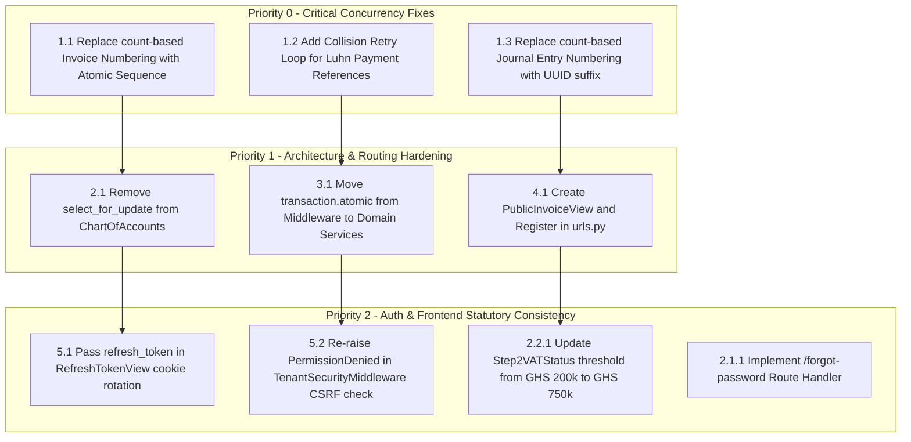

# Mage Books SAAS — Codebase Breakage Points & KISS Convention Audit

> **Exhaustive Technical Audit of Architectural Failure Modes, Concurrency Race Conditions, Transaction Traps, and KISS / DRY Convention Violations across Backend and Frontend Codebases.**
> 
> **Date:** September 2026 | **Status:** Active Reference & Remediation Blueprint  
> **Target Systems:** Backend API (`backend/`) and Next.js / PWA Frontend (`src/`)

---

# Table of Contents
1. [Executive Summary & Purpose](#1-executive-summary--purpose)
2. [Master Priority Classification Matrix](#2-master-priority-classification-matrix)
3. [PART 1: Backend Breakage Points, Race Conditions & KISS Violations](#part-1-backend-breakage-points-race-conditions--kiss-violations)
   - [1.1 Concurrency Race Conditions & Sequence Collisions (P0)](#11-concurrency-race-conditions--sequence-collisions-p0)
     - [1.1.1 Non-Atomic Invoice Number Generation Collision](#111-non-atomic-invoice-number-generation-collision)
     - [1.1.2 Luhn Payment Reference Duplicate Key Collision](#112-luhn-payment-reference-duplicate-key-collision)
     - [1.1.3 Journal Entry Number Sequence Collision](#113-journal-entry-number-sequence-collision)
   - [1.2 Concurrency Bottlenecks & Lock Inversion (P1)](#12-concurrency-bottlenecks--lock-inversion-p1)
     - [1.2.1 Pessimistic Row Locking on Read-Only Chart of Accounts](#121-pessimistic-row-locking-on-read-only-chart-of-accounts)
   - [1.3 Transaction Boundary & Connection Pool Traps (P1)](#13-transaction-boundary--connection-pool-traps-p1)
     - [1.3.1 Universal `transaction.atomic()` Wrapping in Middleware](#131-universal-transactionatomic-wrapping-in-middleware)
   - [1.4 Missing REST Endpoints & Route Configuration Gaps (P1)](#14-missing-rest-endpoints--route-configuration-gaps-p1)
     - [1.4.1 Missing Public Invoice Viewer Endpoint & Middleware Exemption](#141-missing-public-invoice-viewer-endpoint--middleware-exemption)
   - [1.5 Authentication, Session & Error Masking Hazards (P2)](#15-authentication-session--error-masking-hazards-p2)
     - [1.5.1 Omitted Refresh Token Rotation in `RefreshTokenView`](#151-omitted-refresh-token-rotation-in-refreshtokenview)
     - [1.5.2 Masked CSRF Failure in `TenantSecurityMiddleware`](#152-masked-csrf-failure-in-tenantsecuritymiddleware)
     - [1.5.3 Hardcoded Cookie Paths & Reverse Proxy Disconnects](#153-hardcoded-cookie-paths--reverse-proxy-disconnects)
   - [1.6 Premature Optimization & KISS/DRY Redundancies (P2 / P3)](#16-premature-optimization--kissdry-redundancies-p2--p3)
     - [1.6.1 Redundant "Fast Path" Query in Balance Selectors](#161-redundant-fast-path-query-in-balance-selectors)
     - [1.6.2 Triplicate Auditor Role Checks](#162-triplicate-auditor-role-checks)
   - [1.7 Monolithic Procedural Functions (Maintainability Hazards)](#17-monolithic-procedural-functions-maintainability-hazards)
4. [PART 2: Frontend Breakage Points, Inconsistencies & UX Traps](#part-2-frontend-breakage-points-inconsistencies--ux-traps)
   - [2.1 Dead Links & Missing Route Handlers (404 Traps)](#21-dead-links--missing-route-handlers-404-traps)
     - [2.1.1 Dead `/forgot-password` Link in Login Screen](#211-dead-forgot-password-link-in-login-screen)
     - [2.1.2 Dead Footer Links (`href="#"`) across Dashboard Pages](#212-dead-footer-links-href-across-dashboard-pages)
     - [2.1.3 Missing `/dashboard/invoices` Navigation Route](#213-missing-dashboardinvoices-navigation-route)
   - [2.2 Statutory & Regulatory Display Inconsistencies](#22-statutory--regulatory-display-inconsistencies)
     - [2.2.1 Outdated Statutory VAT Threshold in Onboarding Wizard](#221-outdated-statutory-vat-threshold-in-onboarding-wizard)
   - [2.3 Unwired Mock Shells & API Integration Absence](#23-unwired-mock-shells--api-integration-absence)
     - [2.3.1 Unwired Authentication Forms](#231-unwired-authentication-forms)
     - [2.3.2 Unwired 6-Step Onboarding Wizard Submission](#232-unwired-6-step-onboarding-wizard-submission)
     - [2.3.3 Placeholder Dashboard Feature Pages](#233-placeholder-dashboard-feature-pages)
   - [2.4 Client-Side Security & Session Management Gaps](#24-client-side-security--session-management-gaps)
     - [2.4.1 Missing 15-Minute Inactivity Screen Auto-Lock](#241-missing-15-minute-inactivity-screen-auto-lock)
     - [2.4.2 Unsynchronized Mode State between Client and Backend](#242-unsynchronized-mode-state-between-client-and-backend)
5. [PART 3: Prioritized Action Plan & Remediation Guide](#part-3-prioritized-action-plan--remediation-guide)

---

# 1. Executive Summary & Purpose

This audit systematically inspects both the **Django REST Backend** and the **Next.js Frontend** to identify:
1. Places where the code will break at runtime under concurrency, edge-case user inputs, or database error conditions.
2. Violations of **KISS (Keep It Simple, Stupid)**, **YAGNI (You Aren't Gonna Need It)**, and **DRY (Don't Repeat Yourself)** principles that create architectural bottlenecks or maintenance liabilities.
3. Syntactic, structural, or regulatory inconsistencies between the frontend user interface and backend statutory rules.

> **Dedicated Sub-Audits Available:**
> - [**Backend Breakage Points & KISS Audit (`BACKEND_BREAKAGE_AND_KISS_AUDIT.md`)**](file:///m:/CODES/Work/magebooks-SAAS/docs/BACKEND_BREAKAGE_AND_KISS_AUDIT.md) — Dedicated technical report for backend engineers.
> - [**Frontend Breakage Points & UX Traps Audit (`FRONTEND_BREAKAGE_AND_UX_AUDIT.md`)**](file:///m:/CODES/Work/magebooks-SAAS/docs/FRONTEND_BREAKAGE_AND_UX_AUDIT.md) — Dedicated technical report for frontend/UI engineers.

---

# 2. Master Priority Classification Matrix

| Level | Component | Issue Description | File Location | Operational Impact |
| :-: | :---: | :--- | :--- | :--- |
| **P0** | **Backend** | Invoice Number Race Condition | `apps/invoicing/services/invoicing_service.py` | Concurrent invoice creation crashes with unhandled DB `IntegrityError` (HTTP 500). |
| **P0** | **Backend** | Payment Reference Race Condition | `apps/invoicing/utils.py` & `models.py` | Duplicate Luhn reference collision crashes on unique constraint under traffic. |
| **P0** | **Backend** | Journal Entry Sequence Race Condition | `apps/ledger/services/ledger.py` | Non-atomic `.exists()` check permits duplicate sequence keys, crashing on commit. |
| **P1** | **Backend** | Chart of Accounts Lock Bottleneck | `apps/ledger/services/ledger.py` | `select_for_update()` serializes all postings, creating severe concurrency bottlenecks (HTTP 504). |
| **P1** | **Backend** | Universal Middleware `transaction.atomic()` | `apps/tenancy/middleware.py` | Database exceptions mark outer transaction aborted; subsequent queries raise `TransactionManagementError`. |
| **P1** | **Backend** | Missing Tenant Organization Creation Endpoint | `apps/tenancy/urls.py` & `views.py` | Onboarding cannot create an Organization via API; users cannot register tenants. |
| **P1** | **Backend** | Missing Contacts REST Endpoint | `apps/invoicing/urls.py` & `views.py` | No `/api/v1/contacts/` collection to manage customers and suppliers. |
| **P1** | **Backend** | Missing Public Invoice Viewer Endpoint | `apps/invoicing/urls.py` & `views.py` | Customer invoice links return HTTP 404 / 401 Unauthorized; endpoint was never registered. |
| **P1** | **Frontend** | Missing `/dashboard/invoices` Navigation Route | `src/components/dashboard/SideNavBar.tsx` | Central platform feature (invoicing) has no link or dedicated view in the dashboard. |
| **P1** | **Frontend** | Dead "Forgot Password" Link | `src/app/(auth)/login/page.tsx` | Clicking link leads directly to a Next.js 404 page. |
| **P2** | **Backend** | Refresh Token Rotation Cookie Omission | `apps/authentication/views.py` | Turning on SimpleJWT rotation invalidates session and logs users out on refresh. |
| **P2** | **Backend** | Masked CSRF Error in Middleware | `apps/tenancy/middleware.py` | Swallowing broad `Exception` converts HTTP 403 CSRF failures into misleading HTTP 401 Auth errors. |
| **P2** | **Frontend** | Outdated VAT Threshold in UI | `src/components/onboarding/Step2VATStatus.tsx` | Displays obsolete GHS 200,000 threshold instead of statutory Act 1151 GHS 750,000 threshold. |
| **P2** | **Frontend** | Misleading Fiscal Period Default | `src/components/onboarding/Step4FiscalCalendar.tsx` | Suggests "Quarterly" as standard for tax reporting; GRA statutory returns are monthly. |
| **P2** | **Frontend** | Missing TIN / Ghana Card Input Masks | `src/components/onboarding/Step1CompanyDetails.tsx` | Unformatted inputs cause unhandled 400 Bad Request responses on submission. |
| **P2** | **Frontend** | Missing 15-Minute Inactivity Auto-Lock | `src/app/(dashboard)/layout.tsx` | Shared Ghanaian terminals remain unlocked indefinitely (Arch. Manual §4.8.1). |
| **P3** | **Backend** | Redundant "Fast Path" Selector Query | `apps/ledger/selectors.py` | Extra `.exists()` round-trip adds latency and permits unposted line leakage. |
| **P3** | **Frontend** | Orphaned PWA Cache Crypto Module | `src/lib/crypto/pwa-cache-encryption.ts` | 192 lines of AES-GCM encryption code are unused and unreferenced. |
| **P3** | **Frontend** | 16 Unwired Dashboard Mock Shells | `src/app/(dashboard)/dashboard/*` | Dashboard feature pages contain static placeholder text with zero backend API connectivity. |
| **P3** | **Frontend** | Non-Interactive Search & Hardcoded TopBar | `src/components/dashboard/TopNavBar.tsx` | Search is a styled `<div>`; tenant name and avatar are hardcoded. |

---

# PART 1: Backend Breakage Points, Race Conditions & KISS Violations

---

## 1.1 Concurrency Race Conditions & Sequence Collisions (P0)

### 1.1.1 Non-Atomic Invoice Number Generation Collision
* **Location**: [`apps/invoicing/services/invoicing_service.py:150-154`](file:///m:/CODES/Work/magebooks-SAAS/backend/apps/invoicing/services/invoicing_service.py#L150-L154)
* **Offending Code**:
  ```python
  existing_count = Invoice.objects.filter(
      organization=organization,
      issue_date__year=issue_date.year,
  ).count()
  invoice_number = f"INV-{issue_date.year}-{existing_count + 1:05d}"
  ```
* **Failure Mechanism**:
  `existing_count` uses `SELECT COUNT(*)` without row locking or database sequences. When two cashiers or API requests issue invoices within the same second:
  1. Both execute `.count()` simultaneously and receive the same count (e.g., `42`).
  2. Both compute identical invoice numbers: `INV-2026-00043`.
  3. The [`Invoice`](file:///m:/CODES/Work/magebooks-SAAS/backend/apps/invoicing/models.py#L286-L289) model enforces `UniqueConstraint(fields=["organization", "invoice_number"], name="unique_org_invoice_number")`.
  4. The first transaction commits; the second crashes with an unhandled exception:
     ```text
     django.db.utils.IntegrityError: duplicate key value violates unique constraint "unique_org_invoice_number"
     ```
* **KISS Remediation**:
  Use a dedicated atomic sequence table, a PostgreSQL sequence, or wrap invoice creation in a retry loop:
  ```python
  # Retry loop pattern for robust collision resolution
  for attempt in range(5):
      try:
          with transaction.atomic():
              ...
              invoice.save()
              break
      except IntegrityError:
          if attempt == 4:
              raise
          # Increment with high-entropy timestamp suffix on collision
  ```

---

### 1.1.2 Luhn Payment Reference Duplicate Key Collision
* **Location**: [`apps/invoicing/utils.py:189-193`](file:///m:/CODES/Work/magebooks-SAAS/backend/apps/invoicing/utils.py#L189-L193) & [`apps/invoicing/models.py:400-403`](file:///m:/CODES/Work/magebooks-SAAS/backend/apps/invoicing/models.py#L400-L403)
* **Offending Code**:
  ```python
  if seq_number is None:
      count = Invoice.objects.filter(organization=organization).count()
      seq_number = 10001 + count

  return LuhnValidator.generate_reference(seq_number, delimiter="-")
  ```
* **Failure Mechanism**:
  In `Invoice.save()`, if `payment_reference` is empty, it calls `generate_invoice_payment_reference(self.organization)` using `count() + 10001`.
  - Under concurrent saves, identical base sequences (e.g. `10042`) generate identical Luhn references (`10042-8`).
  - Migration `0002_invoice_payment_reference` enforces a unique constraint on `(organization, payment_reference)`.
  - The second request crashes with an unhandled `IntegrityError` (HTTP 500).
* **KISS Remediation**:
  Pass a sequence or add collision detection:
  ```python
  while Invoice.objects.filter(organization=organization, payment_reference=ref).exists():
      seq_number += 1
      ref = LuhnValidator.generate_reference(seq_number, delimiter="-")
  ```

---

### 1.1.3 Journal Entry Number Sequence Collision
* **Location**: [`apps/ledger/services/ledger.py:236-250`](file:///m:/CODES/Work/magebooks-SAAS/backend/apps/ledger/services/ledger.py#L236-L250)
* **Offending Code**:
  ```python
  count = JournalEntry.objects.filter(
      organization=organization,
      entry_date__year=year,
  ).count() + 1
  entry_number = f"JE-{year}-{count:05d}"
  if JournalEntry.objects.filter(organization=organization, entry_number=entry_number).exists():
      entry_number = f"JE-{year}-{uuid6.uuid7().hex[:8].upper()}"
  ```
* **Failure Mechanism**:
  The `.exists()` check is **non-atomic**. If Request A and Request B evaluate `.exists()` before either commits, both receive `False`, bypass the UUID fallback, and insert identical `JE-{year}-{count}` keys, crashing on `unique_org_journal_entry_number`.
* **KISS Remediation**:
  Always append random entropy on automated system entries (e.g., `JE-2026-{uuid7().hex[:8].upper()}`) or use an atomic sequence table.

---

## 1.2 Concurrency Bottlenecks & Lock Inversion (P1)

### 1.2.1 Pessimistic Row Locking on Read-Only Chart of Accounts
* **Location**: [`apps/ledger/services/ledger.py:210-217`](file:///m:/CODES/Work/magebooks-SAAS/backend/apps/ledger/services/ledger.py#L210-L217)
* **Offending Code**:
  ```python
  locked_accounts = list(
      ChartOfAccounts.objects.filter(
          organization=organization,
          id__in=sorted_account_ids,
      )
      .order_by("id")
      .select_for_update()
  )
  ```
* **KISS & Architectural Violation**:
  Architecture Manual §4.3.1 specifically outlines the **Hot Account Solution**:
  > *"Because INSERT statements do not block other INSERT statements in PostgreSQL, concurrent transactions execute simultaneously without holding locks on the master accounts."*
* **Failure Mechanism**:
  In `post_journal_entry`, `ChartOfAccounts` rows are **never updated or modified** (only checked for `is_active`). However, calling `select_for_update()` forces PostgreSQL to acquire exclusive row-level locks on master accounts (such as Account `1010` Cash or Account `1200` Accounts Receivable).
  - All simultaneous transactions touching Cash or AR serialize single-file.
  - If a transaction takes 1.5 seconds (e.g. ReportLab PDF compilation or external gateway call), all other transactions queue up, leading to HTTP 504 Gateway Timeouts or PostgreSQL lock timeouts.
* **KISS Remediation**:
  Remove `select_for_update()`. A standard `SELECT` query is sufficient to verify `is_active` without blocking concurrent writes.

---

## 1.3 Transaction Boundary & Connection Pool Traps (P1)

### 1.3.1 Universal `transaction.atomic()` Wrapping in Middleware
* **Location**: [`apps/tenancy/middleware.py:188-198`](file:///m:/CODES/Work/magebooks-SAAS/backend/apps/tenancy/middleware.py#L188-L198)
* **Offending Code**:
  ```python
  with transaction.atomic():
      self._bind_db_session(tenant_uuid)
      response = self.get_response(request)
  ```
* **Failure Mechanisms**:
  1. **Aborted Transaction Cascades**: If any view or serializer handles a database error internally (e.g. in a try/except block catching `ObjectDoesNotExist` or validating a unique TIN), PostgreSQL marks the underlying transaction as broken. Any subsequent query in that request will raise:
     ```text
     TransactionManagementError: An error occurred in the current transaction. You can't execute queries until the end of the 'atomic' block.
     ```
  2. **Connection Pool Starvation**: Wrapping `get_response(request)` in an atomic transaction holds an active connection and database lock for the entire request duration (including serialization, PDF rendering, and response transmission).
  3. **Silent Commit on HTTP 4xx Errors**: If a view catches an error and returns `Response({"error": ...}, status=400)`, any database writes that occurred before the validation failure are **silently committed** by the middleware exit.
* **KISS Remediation**:
  Remove `transaction.atomic()` from the middleware. Scope atomic transactions exclusively to the domain service methods (`InvoicingService`, `LedgerService`, `PayrollApprovalService`).

---

## 1.4 Missing REST Endpoints & Route Configuration Gaps (P1)

### 1.4.1 Missing Public Invoice Viewer Endpoint & Middleware Exemption
* **Location**: [`apps/invoicing/urls.py`](file:///m:/CODES/Work/magebooks-SAAS/backend/apps/invoicing/urls.py) & [`apps/invoicing/views.py`](file:///m:/CODES/Work/magebooks-SAAS/backend/apps/invoicing/views.py)
* **Failure Mechanism**:
  - The model inherits from [`PublicShareableMixin`](file:///m:/CODES/Work/magebooks-SAAS/backend/apps/core/models.py) with `share_token = uuid4()`, and documentation references `GET /api/v1/invoicing/public/<share_token>/`.
  - **No view exists in `apps/invoicing/views.py`** and **no URL is registered in `apps/invoicing/urls.py`**.
  - Furthermore, `/api/v1/invoicing/public/` is missing from `TenantSecurityMiddleware.EXEMPT_PATH_PREFIXES` ([`apps/tenancy/middleware.py:63-70`](file:///m:/CODES/Work/magebooks-SAAS/backend/apps/tenancy/middleware.py#L63-L70)). Even if added to `urls.py`, unauthenticated customers viewing public invoice links receive HTTP 401 Unauthorized.
* **KISS Remediation**:
  1. Add `PublicInvoiceView(APIView)` with `permission_classes = [AllowAny]` returning public invoice metadata and PDF stream.
  2. Register `path("invoicing/public/<uuid:share_token>/", PublicInvoiceView.as_view())`.
  3. Add `"/api/v1/invoicing/public/"` to `TenantSecurityMiddleware.EXEMPT_PATH_PREFIXES`.

---

## 1.5 Authentication, Session & Error Masking Hazards (P2)

### 1.5.1 Omitted Refresh Token Rotation in `RefreshTokenView`
* **Location**: [`apps/authentication/views.py:126-138`](file:///m:/CODES/Work/magebooks-SAAS/backend/apps/authentication/views.py#L126-L138)
* **Offending Code**:
  ```python
  refresh = RefreshToken(raw_refresh)
  new_access_token = str(refresh.access_token)
  set_jwt_cookies(response, access_token=new_access_token)  # refresh_token is None!
  ```
* **Failure Mechanism**:
  `set_jwt_cookies(response, access_token, refresh_token=None)` only attaches a refresh cookie if `refresh_token is not None`.
  - When a developer sets `"ROTATE_REFRESH_TOKENS": True` in production, SimpleJWT blacklists the old refresh token.
  - Because no new refresh cookie is attached, the client retains the blacklisted token.
  - The very next refresh attempt crashes with `TokenError: Token is invalid or expired`, unexpectedly logging out active users.
* **KISS Remediation**:
  If refresh rotation is enabled, pass the rotated token:
  ```python
  if api_settings.ROTATE_REFRESH_TOKENS:
      refresh.set_jti()
      refresh.set_exp()
      set_jwt_cookies(response, access_token=new_access_token, refresh_token=str(refresh))
  ```

---

### 1.5.2 Masked CSRF Failure in `TenantSecurityMiddleware`
* **Location**: [`apps/tenancy/middleware.py:216-225`](file:///m:/CODES/Work/magebooks-SAAS/backend/apps/tenancy/middleware.py#L216-L225) & [`apps/authentication/authentication.py:33-35`](file:///m:/CODES/Work/magebooks-SAAS/backend/apps/authentication/authentication.py#L33-L35)
* **Offending Code**:
  ```python
  def _resolve_jwt_user(self, request: HttpRequest) -> Any:
      try:
          auth_result = self.jwt_authenticator.authenticate(request)
          if auth_result is not None:
              user, _ = auth_result
              return user
      except (InvalidToken, TokenError, Exception):  # Catches all exceptions!
          pass
      return None
  ```
* **Failure Mechanism**:
  When a user with a valid JWT cookie makes a mutating request (`POST`/`PUT`/`DELETE`) but omits or provides an invalid `X-CSRFToken` header, [`enforce_csrf`](file:///m:/CODES/Work/magebooks-SAAS/backend/apps/authentication/authentication.py#L24-L35) raises `exceptions.PermissionDenied("CSRF Failed: ...")`.
  - Because `_resolve_jwt_user` catches broad `Exception`, it swallows the CSRF error and returns `None`.
  - The middleware then reports: `{"detail": "Authentication credentials were not provided."}` (HTTP 401).
  - This masks the true CSRF error (HTTP 403), misleading developers into thinking their authentication cookies are missing.
* **KISS Remediation**:
  Do not swallow `PermissionDenied` in `_resolve_jwt_user`; re-raise it so Django returns a proper HTTP 403 CSRF failure response.

---

### 1.5.3 Hardcoded Cookie Paths & Reverse Proxy Disconnects
* **Location**: [`apps/authentication/views.py:57, 67`](file:///m:/CODES/Work/magebooks-SAAS/backend/apps/authentication/views.py#L57)
* **Offending Code**:
  ```python
  response.set_cookie(key=refresh_cookie_name, ..., path="/api/v1/auth/")
  ```
* **Failure Mechanism**:
  The refresh token cookie is scoped strictly to `path="/api/v1/auth/"`. If a frontend Next.js application proxies authentication requests via `/api/auth/` (omitting `v1`), the browser will refuse to transmit the cookie.

---

## 1.6 Premature Optimization & KISS/DRY Redundancies (P2 / P3)

### 1.6.1 Redundant "Fast Path" Query in Balance Selectors
* **Location**: [`apps/ledger/selectors.py:264-272`](file:///m:/CODES/Work/magebooks-SAAS/backend/apps/ledger/selectors.py#L264-L272)
* **Offending Code**:
  ```python
  has_unposted = (
      JournalEntry.objects.filter(organization=organization, is_posted=False)
      .order_by()
      .exists()
  )
  if has_unposted:
      lines_qs = lines_qs.filter(journal_entry__is_posted=True)
  ```
* **KISS Violation & Race Condition**:
  This "fast path" attempted to avoid an SQL `INNER JOIN` by executing an extra `.exists()` database query round-trip on every balance calculation.
  - Adding an extra database query round-trip on every balance query is slower than letting PostgreSQL execute an indexed join.
  - If a concurrent transaction inserts an unposted journal entry between the `.exists()` check and the aggregate query, unposted journal lines will leak into the trial balance totals.
* **KISS Remediation**:
  Delete the `has_unposted` check and unconditionally filter `journal_entry__is_posted=True`.

---

### 1.6.2 Triplicate Auditor Role Checks
* **Location**: [`apps/invoicing/views.py:45, 94-99`](file:///m:/CODES/Work/magebooks-SAAS/backend/apps/invoicing/views.py#L45) & [`apps/tenancy/middleware.py:164-181`](file:///m:/CODES/Work/magebooks-SAAS/backend/apps/tenancy/middleware.py#L164-L181)
* **Code & DRY Violation**:
  The auditor read-only constraint is evaluated three separate times on the same request:
  1. In `TenantSecurityMiddleware` Guard 4.
  2. In `permission_classes = [IsAuditorReadOnly]`.
  3. Inside the `post()` method: `if role == RoleChoices.AUDITOR: return Response(...)`.
* **KISS Remediation**:
  Rely on DRF's `IsAuditorReadOnly` permission class and delete manual boilerplate from individual view methods.

---

## 1.7 Monolithic Procedural Functions (Maintainability Hazards)

Several functions exceed 150–450 lines, mixing multiple distinct responsibilities in a single procedural block:

| Function | File | Lines | Responsibilities Tangled |
| :--- | :--- | :---: | :--- |
| `compile_invoice_pdf` | [`apps/invoicing/services/pdf_compiler.py`](file:///m:/CODES/Work/magebooks-SAAS/backend/apps/invoicing/services/pdf_compiler.py#L62-L518) | **455** | Color palettes, typography styling, SSRF regex checks, table layout math, vector QR widgets, flowable story building. |
| `reconcile_payment` | [`apps/payments/services/reconciliation.py`](file:///m:/CODES/Work/magebooks-SAAS/backend/apps/payments/services/reconciliation.py#L162-L525) | **363** | Luhn parsing, invoice matching, partial payment logic, suspense account quarantine, GL entry construction, status updating. |
| `post_journal_entry` | [`apps/ledger/services/ledger.py`](file:///m:/CODES/Work/magebooks-SAAS/backend/apps/ledger/services/ledger.py#L69-L297) | **228** | Fiscal period validation, line normalization, debit/credit sum math, account locking, entry number generation, line creation. |
| `approve_payroll_run` | [`apps/payroll/services/approval_service.py`](file:///m:/CODES/Work/magebooks-SAAS/backend/apps/payroll/services/approval_service.py#L81-L261) | **180** | Maker-Checker validation, TOTP verification, account bootstrapping, GL line construction, status saving, audit log creation. |

* **KISS Remediation**:
  Decompose into private helper methods (`_validate_lines`, `_build_gl_lines`, `_format_table_headers`).

---

# PART 2: Frontend Breakage Points, Inconsistencies & UX Traps

---

## 2.1 Dead Links & Missing Route Handlers (404 Traps)

### 2.1.1 Dead `/forgot-password` Link in Login Screen
* **Location**: [`src/app/(auth)/login/page.tsx:56-60`](file:///m:/CODES/Work/magebooks-SAAS/src/app/(auth)/login/page.tsx#L56-L60)
* **Offending Code**:
  ```tsx
  <Link href="/forgot-password" className="text-sm text-[#004ac6] hover:underline">
    Forgot Password?
  </Link>
  ```
* **Failure Mechanism**:
  The directory `src/app/(auth)/forgot-password/page.tsx` does not exist. Clicking the link on the login page immediately returns an unhandled Next.js 404 Not Found error.
* **Remediation**:
  Create the `/forgot-password` page route or temporarily point the link to an informative modal/support email.

---

### 2.1.2 Dead Footer Links (`href="#"`) across Dashboard Pages
* **Location**: [`src/app/(dashboard)/dashboard/transactions/page.tsx:37-39`](file:///m:/CODES/Work/magebooks-SAAS/src/app/(dashboard)/dashboard/transactions/page.tsx#L37-L39) (and replicated across multiple dashboard screens)
* **Offending Code**:
  ```tsx
  <Link href="#" className="hover:underline">Privacy Policy</Link>
  <Link href="#" className="hover:underline">Terms of Service</Link>
  <Link href="#" className="hover:underline">Help Center</Link>
  ```
* **Failure Mechanism**:
  Clicking `href="#"` jumps the user back to the top of the viewport without navigating, confusing users.

---

### 2.1.3 Missing `/dashboard/invoices` Navigation Route
* **Location**: [`src/components/dashboard/SideNavBar.tsx:16-57`](file:///m:/CODES/Work/magebooks-SAAS/src/components/dashboard/SideNavBar.tsx#L16-L57)
* **Failure Mechanism**:
  The sidebar navigation includes links for `/dashboard/receipts`, `/dashboard/accounts-receivable`, and `/dashboard/transactions`, but **completely omits a dedicated route for `/dashboard/invoices`**.
  - While backend invoicing endpoints (`/api/v1/invoices/`) are the central feature of the platform, the frontend has no dedicated Invoices menu item or page directory.

---

## 2.2 Statutory & Regulatory Display Inconsistencies

### 2.2.1 Outdated Statutory VAT Threshold in Onboarding Wizard
* **Location**: [`src/components/onboarding/Step2VATStatus.tsx:78`](file:///m:/CODES/Work/magebooks-SAAS/src/components/onboarding/Step2VATStatus.tsx#L78)
* **Offending Code**:
  ```tsx
  VAT registration is mandatory in Ghana for businesses making taxable supplies exceeding GHS 200,000 over 12 months.
  ```
* **Failure Mechanism**:
  Under the **Value Added Tax Act, 2025 (Act 1151)**, effective January 1, 2026, the Parliament of Ghana raised the statutory mandatory VAT registration threshold to **GHS 750,000**.
  - The backend statutory engine enforces `STATUTORY_VAT_THRESHOLD = Decimal('750000.0000')` ([`apps/tax/services.py:28`](file:///m:/CODES/Work/magebooks-SAAS/backend/apps/tax/services.py#L28)).
  - Displaying GHS 200,000 misinforms Ghanaian business owners and causes non-qualifying sole traders to register for VAT erroneously.
* **Remediation**:
  Update the copy to:
  ```tsx
  VAT registration is mandatory in Ghana for businesses making taxable supplies exceeding GHS 750,000 over 12 months under Act 1151.
  ```

---

## 2.3 Unwired Mock Shells & API Integration Absence

### 2.3.1 Unwired Authentication Forms
* **Location**: [`src/app/(auth)/login/page.tsx:13-16`](file:///m:/CODES/Work/magebooks-SAAS/src/app/(auth)/login/page.tsx#L13-L16) & [`src/app/(auth)/signup/page.tsx:16-20`](file:///m:/CODES/Work/magebooks-SAAS/src/app/(auth)/signup/page.tsx#L16-L20)
* **Offending Code**:
  ```tsx
  const handleSubmit = (e: React.FormEvent) => {
    e.preventDefault();
    // TODO: wire up auth logic
    router.push("/onboarding");
  };
  ```
* **Failure Mechanism**:
  The form accepts any credentials without validation, executes zero network requests to `/api/v1/auth/login/` or `/api/v1/auth/signup/`, and routes directly to `/onboarding`.

---

### 2.3.2 Unwired 6-Step Onboarding Wizard Submission
* **Location**: [`src/app/(onboarding)/onboarding/page.tsx:51-54`](file:///m:/CODES/Work/magebooks-SAAS/src/app/(onboarding)/onboarding/page.tsx#L51-L54)
* **Offending Code**:
  ```tsx
  const handleFinish = () => {
    // TODO: submit onboarding data to API
    router.push("/dashboard");
  };
  ```
* **Failure Mechanism**:
  All collected company details, TIN, director Ghana Card PIN, and initial contacts collected in Steps 1–6 are discarded from React state on finish, creating no organization or memberships in the backend.

---

### 2.3.3 Placeholder Dashboard Feature Pages
* **Location**: [`src/app/(dashboard)/dashboard/*`](file:///m:/CODES/Work/magebooks-SAAS/src/app/(dashboard)/dashboard) (16 pages)
* **Failure Mechanism**:
  16 out of 17 dashboard pages contain identical static placeholder text:
  ```tsx
  <p className="font-semibold text-[#141b2b] text-lg mb-1">No transactions yet</p>
  <p className="text-sm">Your transaction history will appear here.</p>
  ```
  None of these pages fetch data from the corresponding backend REST endpoints (`/api/v1/reports/`, `/api/v1/payroll/runs/`, `/api/v1/audit/trail/`, etc.).

---

## 2.4 Client-Side Security & Session Management Gaps

### 2.4.1 Missing 15-Minute Inactivity Screen Auto-Lock
* **Reference**: *Architecture Manual §4.8.1 (Client-Side Fail-Secure Hygiene)*:
  > *"To safeguard shared office terminals in Ghana, client applications detect idle time and automatically lock the screen after 15 minutes, clearing active memory."*
* **Failure Mechanism**:
  No idle-timer hook or screen-lock overlay is currently implemented in `src/app/layout.tsx` or `src/contexts/`.

---

### 2.4.2 Unsynchronized Mode State between Client and Backend
* **Location**: [`src/contexts/ModeContext.tsx:21-28`](file:///m:/CODES/Work/magebooks-SAAS/src/contexts/ModeContext.tsx#L21-L28)
* **Failure Mechanism**:
  The experience mode (`simple` vs. `full`) is toggled exclusively in client `localStorage` under `mage-mode`. It is not synchronized with `Organization.default_experience_mode` on the backend, meaning switching devices or browsers reverts the user's mode preference.

---

# PART 3: Prioritized Action Plan & Remediation Guide



### Remediation Checklist

1. **Backend Immediate Fixes (P0 & P1)**:
   - [ ] Implement atomic collision retry loop in `apps/invoicing/services/invoicing_service.py`.
   - [ ] Add collision detection while generating Luhn payment references in `apps/invoicing/utils.py`.
   - [ ] Remove `select_for_update()` from `apps/ledger/services/ledger.py` on `ChartOfAccounts`.
   - [ ] Scope `transaction.atomic()` to domain services; remove from `TenantSecurityMiddleware`.
   - [ ] Implement `PublicInvoiceView` in `apps/invoicing/views.py` and exempt `/api/v1/invoicing/public/`.
   - [ ] Pass `refresh_token` in `RefreshTokenView.set_jwt_cookies`.

2. **Frontend Immediate Fixes (P2 & P3)**:
   - [ ] Update `src/components/onboarding/Step2VATStatus.tsx` threshold text to GHS 750,000.
   - [ ] Implement `src/app/(auth)/forgot-password/page.tsx`.
   - [ ] Add `/dashboard/invoices` link and page component.
   - [ ] Replace `href="#"` with valid route links or remove dead anchors.
   - [ ] Implement 15-minute inactivity auto-lock hook in `src/app/(dashboard)/layout.tsx`.
